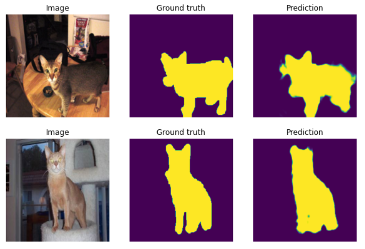

<div align="center">
<h1>
  Pytorch Kullanarak Semantik Segmentasyon Uygulaması
</h1>
<h4>
    
</h4>

</div>

1. Kütüphanelerin Yüklenmesi:

```
pip install -r requirements.txt
```


2.Kütüphanelerin İmport Edilmesi:

```
from oxford_pet import SimpleOxfordPetDataset
import segmentation_models_pytorch as smp
from catalyst import utils
import os
import torch
import matplotlib.pyplot as plt
from torch.utils.data import DataLoader
```

3. GPU Ayarları:
```
# Setting up GPU
# os.environ["CUDA_VISIBLE_DEVICES"] = "0"  # "" - CPU, "0" - 1 GPU, "0,1" - MultiGPU
SEED = 42
utils.set_global_seed(SEED)
utils.prepare_cudnn(deterministic=True)
```

4. Dataset Oluşturma:

```
# Datasets
root = "."
SimpleOxfordPetDataset.download(root)
```

5. Dataset'i Train/Test/Val Kümelere Bölme:
```
# init train, val, test sets
train_dataset = SimpleOxfordPetDataset(root, "train")
valid_dataset = SimpleOxfordPetDataset(root, "valid")
test_dataset = SimpleOxfordPetDataset(root, "test")
```

6. DataLoader Oluşturma:

```
n_cpu = os.cpu_count()
train_dataloader = DataLoader(train_dataset, batch_size=16, shuffle=True, num_workers=n_cpu)
valid_dataloader = DataLoader(valid_dataset, batch_size=16, shuffle=False, num_workers=n_cpu)
test_dataloader = DataLoader(test_dataset, batch_size=16, shuffle=False, num_workers=n_cpu)
```

7. Veri Setini Görselleştirme:
```
# lets look at some samples
sample = train_dataset[0]
plt.subplot(1, 2, 1)
plt.imshow(sample["image"].transpose(1, 2, 0))  # for visualization we have to transpose back to HWC
plt.subplot(1, 2, 2)
plt.imshow(sample["mask"].squeeze())  # for visualization we have to remove 3rd dimension of mask
# plt.show()

sample = valid_dataset[0]
plt.subplot(1, 2, 1)
plt.imshow(sample["image"].transpose(1, 2, 0))  # for visualization we have to transpose back to HWC
plt.subplot(1, 2, 2)
plt.imshow(sample["mask"].squeeze())  # for visualization we have to remove 3rd dimension of mask
# plt.show()

sample = test_dataset[0]
plt.subplot(1, 2, 1)
plt.imshow(sample["image"].transpose(1, 2, 0))  # for visualization we have to transpose back to HWC
plt.subplot(1, 2, 2)
plt.imshow(sample["mask"].squeeze())  # for visualization we have to remove 3rd dimension of mask
# plt.show()
```

8. Model Oluşturma:
```
# Create segmentation model
model = smp.Unet("resnet34", encoder_weights="imagenet", classes=1, activation=None)
```
9. Model Test Etme:
```
batch = next(iter(test_dataloader))
with torch.no_grad():
    model.eval()
    logits = model(batch["image"].float())

pr_masks = logits.sigmoid()
```


10. Prediction Sonuçlarını Görselleştirme:
```
for image, gt_mask, pr_mask in zip(batch["image"], batch["mask"], pr_masks):
    plt.figure(figsize=(10, 5))

    plt.subplot(1, 3, 1)
    plt.imshow(image.numpy().transpose(1, 2, 0))  # convert CHW -> HWC
    plt.title("Image")
    plt.axis("off")

    plt.subplot(1, 3, 2)
    plt.imshow(gt_mask.numpy().squeeze())  # just squeeze classes dim, because we have only one class
    plt.title("Ground truth")
    plt.axis("off")

    plt.subplot(1, 3, 3)
    plt.imshow(pr_mask.numpy().squeeze())  # just squeeze classes dim, because we have only one class
    plt.title("Prediction")
    plt.axis("off")
    plt.show()
```
